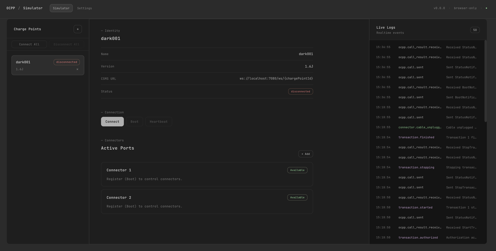
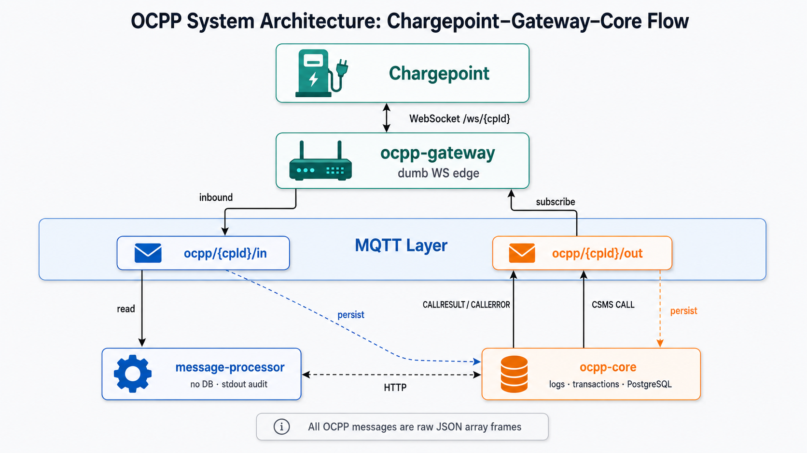

# OCPP Simulator

A local-first, web-based OCPP charge point simulator for developers testing EV charging backends. Currently targets OCPP 1.6J, with an architecture designed to support OCPP 2.0.1 in the future.



## Architecture



| Service | Role | DB | MQTT |
|---|---|---|---|
| `ocpp-gateway` | WebSocket ↔ MQTT bridge per charge point | No | Yes |
| `message-processor` | Handles CP → server responses | No | Yes |
| `ocpp-core` | Source of truth for logs & transactions | Yes (PostgreSQL) | Yes |
| `web` | Vue 3 UI for simulator control | IndexedDB | No |

## Development

**Prerequisites:**
- Go 1.21+
- Node.js 20+ & pnpm 9.x
- Docker & Docker Compose

### Quick Start (Docker Compose)

```bash
docker compose up -d --build
```
- **UI:** http://localhost:5173
- **Gateway:** ws://localhost:7080/ws/{chargePointId}
- **Core:** http://localhost:7090

### Local Dev Workflow

To run the backends in Docker and the UI locally with Vite HMR:

```bash
make dev
```

Other useful commands:
```bash
make down               # Stop backend stack
make dev-stack          # Run backends only
make test               # Run all Go tests
make wire-dump          # Run a fake CP to capture raw OCPP frames
```

## Structure

- `apps/ocpp-gateway/`: WebSocket edge service.
- `apps/message-processor/`: Business logic for CP messages.
- `apps/ocpp-core/`: Database and transaction management.
- `apps/web/`: Vue 3 simulator dashboard.
- `packages/ocpp-protocol/`: Shared OCPP encoding/decoding.
- `packages/ocpp-schemas/`: JSON schema validation.

## License

MIT
